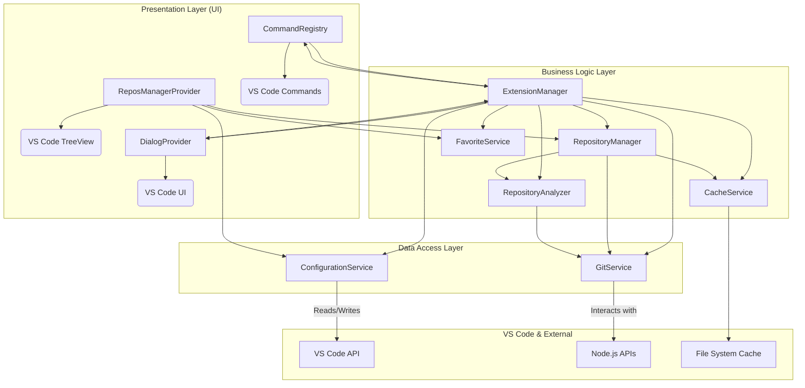
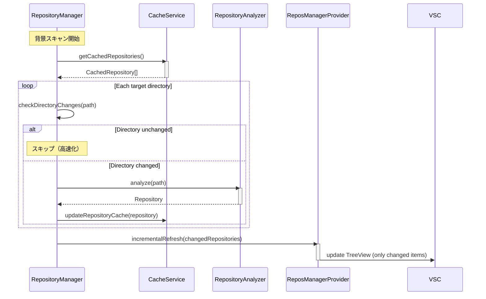
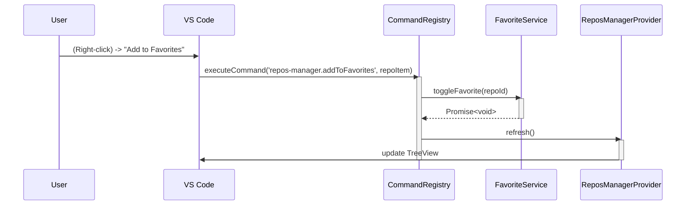
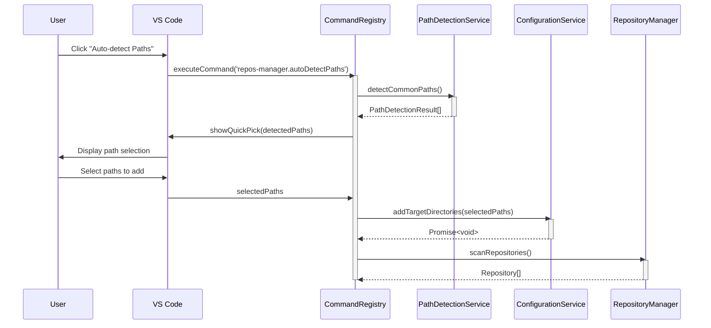
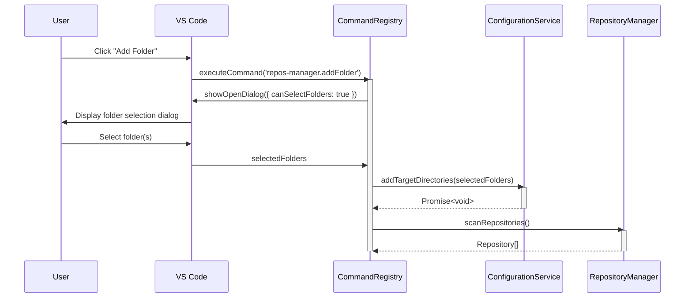

# Repos-Manager 詳細設計書

## 1. システム構成

### 1.1. アーキテクチャ概要



### 1.2. 主要コンポーネントの責務

- **ExtensionManager**: 拡張機能全体のライフサイクルを管理する中心的なクラス。各サービスの初期化、コマンドの登録、イベントリスナーの設定などを行う。
- **ReposManagerProvider**: サイドバーのツリービューに表示するリポジトリのリストを管理し、UIを更新する。空状態時のユーザー支援UIも担当。
- **RepositoryManager**: ローカルのリポジトリ（Git管理内外問わず）をスキャンし、リストを管理する。キャッシュからの高速読み込みと背景スキャンを担当。
- **RepositoryAnalyzer**: 個々のリポジトリの内容を分析し、主要言語や最終更新日などのメタデータを抽出する。
- **GitService**: Gitコマンドを実行し、ブランチ情報や変更状態などを取得する。
- **ConfigurationService**: VS Codeの設定（`settings.json`）の読み書きを行う。自動検知パスの管理も担当。
- **FavoriteService**: お気に入りのリポジトリの状態を管理する。
- **CommandRegistry**: 拡張機能のコマンドを登録し、実行ロジックを紐付ける。
- **DialogProvider**: ユーザーへの情報表示（情報、警告、エラーメッセージ）や入力（QuickPick）を管理する。
- **PathDetectionService**: 一般的なリポジトリ保存場所の自動検知機能を提供する。
- **CacheService**: リポジトリスキャン結果のキャッシュ管理。起動パフォーマンス向上と差分更新を担当。

## 2. データモデル (TypeScript Interfaces)

### 2.1. `Repository`

リポジトリまたは管理対象フォルダの情報を保持する中心的なデータ構造。

```typescript
// src/types/index.ts

/**
 * 管理対象のリポジトリまたはフォルダを表すインターフェース
 */
export interface Repository {
  id: string; // パスから生成された一意のID
  name: string; // フォルダ名
  path: string; // フルパス
  isGit: boolean; // Gitリポジトリであるか
  gitInfo?: GitInfo; // Gitリポジトリの場合の情報
  mainLanguage?: string; // 主要言語
  lastModified: number; // 最終更新日時 (Unixタイムスタンプ)
  isFavorite: boolean; // お気に入り登録されているか
}

/**
 * Gitリポジトリに関する情報
 */
export interface GitInfo {
  currentBranch: string;
  hasUncommittedChanges: boolean;
  lastCommitDate?: Date;
}
```

### 2.2. `ExtensionConfig`

`settings.json` から読み込む拡張機能の設定。

```typescript
// src/types/index.ts

/**
 * 拡張機能の設定
 */
export interface ExtensionConfig {
  scan: {
    targetDirectories: string[];
    excludePatterns: string[];
    autoDetectPaths: string[]; // 自動検知候補パス
  };
  display: {
    showLastUpdateTime: boolean;
    showLanguageIcon: boolean;
    highlightUpdatedWithinDays: number;
  };
  cache: {
    enabled: boolean; // キャッシュ機能の有効/無効
    maxAge: number; // キャッシュの最大有効期間（秒）
    backgroundScan: boolean; // 背景スキャンの有効/無効
  };
}
```

### 2.3. `EmptyStateAction`

空状態時のアクションボタンの情報を表すインターフェース。

```typescript
// src/types/index.ts

/**
 * 空状態時のアクションボタン
 */
export interface EmptyStateAction {
  id: string; // アクションID
  label: string; // ボタンラベル
  icon: string; // アイコン名（Codicon）
  tooltip: string; // ツールチップ
  command: string; // 実行するコマンドID
}

/**
 * 自動検知の結果
 */
export interface PathDetectionResult {
  path: string; // 検知されたパス
  hasRepositories: boolean; // リポジトリ/フォルダが存在するか
  repositoryCount: number; // 見つかったリポジトリ数
  folderCount: number; // 見つかったフォルダ数
}
```

### 2.4. `RepositoryCache`

リポジトリスキャン結果のキャッシュデータ構造。

```typescript
// src/types/index.ts

/**
 * リポジトリキャッシュのデータ構造
 */
export interface RepositoryCache {
  version: string; // キャッシュフォーマットのバージョン
  timestamp: number; // キャッシュ作成時刻（Unixタイムスタンプ）
  targetDirectories: string[]; // スキャン対象ディレクトリ（設定変更検知用）
  repositories: CachedRepository[]; // キャッシュされたリポジトリリスト
}

/**
 * キャッシュされたリポジトリ情報
 */
export interface CachedRepository extends Repository {
  cacheTimestamp: number; // このリポジトリの最終キャッシュ時刻
  directoryLastModified: number; // ディレクトリの最終更新時刻
}

/**
 * スキャン戦略の設定
 */
export interface ScanStrategy {
  useCache: boolean; // キャッシュを使用するか
  backgroundScan: boolean; // 背景スキャンを実行するか
  cacheMaxAge: number; // キャッシュの最大有効期間（秒）
  incrementalScan: boolean; // 差分スキャンを使用するか
}
```

## 3. 主要機能のシーケンス図

### 3.2. 差分スキャンによる背景更新



### 3.3. リポジトリをお気に入りに追加



### 3.4. 空状態での自動パス検知



### 3.5. フォルダ追加ダイアログ



## 4. API設計 (コマンド)

`package.json` の `contributes.commands` と同期させる。

| コマンドID                               | 説明                                       | 実行コンテキスト |
| ---------------------------------------- | ------------------------------------------ | ---------------- |
| `repos-manager.refresh`                  | リポジトリリストを再スキャンして更新します。 | コマンドパレット |
| `repos-manager.openRepository`           | 選択したリポジトリを現在のウィンドウで開きます。 | ツリービュー項目 |
| `repos-manager.openInNewWindow`          | 選択したリポジトリを新しいウィンドウで開きます。 | ツリービュー項目 |
| `repos-manager.addToFavorites`           | 選択したリポジトリをお気に入りに追加します。 | ツリービュー項目 |
| `repos-manager.removeFromFavorites`      | 選択したリポジトリをお気に入りから削除します。 | ツリービュー項目 |
| `repos-manager.openInTerminal`           | 選択したリポジトリのパスでターミナルを開きます。 | ツリービュー項目 |
| `repos-manager.openInFileExplorer`       | 選択したリポジトリをファイルエクスプローラーで開きます。 | ツリービュー項目 |
| `repos-manager.autoDetectPaths`          | 一般的なリポジトリ保存場所を自動検知してスキャンパスに追加します。 | 空状態UI |
| `repos-manager.addFolder`                | フォルダ選択ダイアログでスキャンパスに追加します。 | 空状態UI |
| `repos-manager.openSettings`             | VS Code設定の拡張機能セクションを開きます。 | 空状態UI |

## 5. 新機能の実装詳細

### 5.1. PathDetectionService

一般的なリポジトリ保存場所の自動検知機能を提供するサービス。

```typescript
// src/services/PathDetectionService.ts

export class PathDetectionService {
  private readonly defaultPaths = [
    '~/Documents/GitHub',
    '~/Documents/github',
    '~/Projects',
    '~/workspace',
    '~/dev',
    '~/code',
    '~/source',
    '~/repos'
  ];

  /**
   * 一般的なリポジトリ保存場所を自動検知
   * @returns 検知されたパスと統計情報
   */
  async detectCommonPaths(): Promise<PathDetectionResult[]> {
    // 実装詳細
  }

  /**
   * 指定されたパスでリポジトリ/フォルダをスキャン
   * @param path スキャン対象パス
   * @returns スキャン結果
   */
  async scanPath(path: string): Promise<PathDetectionResult> {
    // 実装詳細
  }

  /**
   * パス展開（~を実際のホームディレクトリに変換）
   * @param path 展開対象パス
   * @returns 展開されたパス
   */
  private expandPath(path: string): string {
    // 実装詳細
  }
}
```

### 5.2. RepositoryManager の拡張（キャッシュ対応）

```typescript
// src/core/RepositoryManager.ts (拡張部分)

export class RepositoryManager {
  // ...既存のコード...

  constructor(
    private readonly cacheService: CacheService,
    // ...その他の依存関係...
  ) {}

  /**
   * キャッシュを使用した高速リポジトリ読み込み
   * @returns キャッシュされたリポジトリリスト
   */
  async loadRepositoriesFromCache(): Promise<Repository[]> {
    const cachedRepos = await this.cacheService.loadCache();
    if (!cachedRepos) {
      return [];
    }

    // キャッシュからRepositoryオブジェクトに変換
    return cachedRepos.map(cached => ({
      id: cached.id,
      name: cached.name,
      path: cached.path,
      isGit: cached.isGit,
      gitInfo: cached.gitInfo,
      mainLanguage: cached.mainLanguage,
      lastModified: cached.lastModified,
      isFavorite: cached.isFavorite
    }));
  }

  /**
   * 背景での差分スキャン
   * @param cachedRepositories キャッシュされたリポジトリリスト
   * @returns 更新されたリポジトリリスト
   */
  async performBackgroundScan(cachedRepositories: Repository[]): Promise<Repository[]> {
    const targetDirectories = this.configurationService.getTargetDirectories();
    const updatedRepositories: Repository[] = [];
    const validPaths: string[] = [];

    for (const targetDir of targetDirectories) {
      try {
        const foundRepos = await this.scanDirectory(targetDir);

        for (const repo of foundRepos) {
          validPaths.push(repo.path);

          // キャッシュされたリポジトリと比較
          const cachedRepo = cachedRepositories.find(c => c.path === repo.path);

          if (!cachedRepo) {
            // 新しいリポジトリ
            updatedRepositories.push(repo);
            await this.cacheService.updateRepositoryCache(repo);
          } else {
            // ディレクトリ変更チェック
            const cachedWithTimestamp = await this.cacheService.loadCache();
            const cached = cachedWithTimestamp?.find(c => c.path === repo.path);

            if (cached && await this.cacheService.isDirectoryChanged(cached)) {
              // 変更されたリポジトリを再分析
              const updatedRepo = await this.repositoryAnalyzer.analyze(repo.path);
              updatedRepositories.push(updatedRepo);
              await this.cacheService.updateRepositoryCache(updatedRepo);
            }
          }
        }
      } catch (error) {
        console.warn(`Failed to scan directory ${targetDir}:`, error);
      }
    }

    // 無効なキャッシュエントリを削除
    await this.cacheService.cleanupCache(validPaths);

    return updatedRepositories;
  }

  /**
   * フルスキャン実行（初回またはキャッシュ無効時）
   * @returns 全リポジトリリスト
   */
  async performFullScan(): Promise<Repository[]> {
    const repositories = await this.scanRepositories();
    await this.cacheService.saveCache(repositories);
    return repositories;
  }

  /**
   * スマートスキャン：キャッシュがあれば背景スキャン、なければフルスキャン
   * @returns { cached: Repository[], updated?: Repository[] }
   */
  async performSmartScan(): Promise<{ cached: Repository[], updated?: Repository[] }> {
    const cachedRepositories = await this.loadRepositoriesFromCache();

    if (cachedRepositories.length > 0) {
      // キャッシュがある場合：即座に表示 + 背景更新
      const updatedRepositories = await this.performBackgroundScan(cachedRepositories);
      return {
        cached: cachedRepositories,
        updated: updatedRepositories.length > 0 ? updatedRepositories : undefined
      };
    } else {
      // キャッシュがない場合：フルスキャン
      const repositories = await this.performFullScan();
      return { cached: repositories };
    }
  }
}
```

### 5.3. 空状態UI の実装

ReposManagerProvider に空状態時の UI 表示機能を追加。

```typescript
// src/ui/ReposManagerProvider.ts (追加部分)

export class ReposManagerProvider implements vscode.TreeDataProvider<RepoTreeItem> {
  // ...既存のコード...

  /**
   * 空状態時のアクションボタンを生成
   */
  private createEmptyStateActions(): EmptyStateAction[] {
    return [
      {
        id: 'autoDetect',
        label: 'Auto-detect Paths',
        icon: 'search',
        tooltip: 'Automatically detect common repository locations',
        command: 'repos-manager.autoDetectPaths'
      },
      {
        id: 'openSettings',
        label: 'Settings',
        icon: 'gear',
        tooltip: 'Open extension settings',
        command: 'repos-manager.openSettings'
      },
      {
        id: 'addFolder',
        label: 'Add Folder',
        icon: 'folder-opened',
        tooltip: 'Select folder to scan for repositories',
        command: 'repos-manager.addFolder'
      }
    ];
  }

  /**
   * 空状態時のツリーアイテムを生成
   */
  private createEmptyStateTreeItems(): RepoTreeItem[] {
    const emptyStateItem = new RepoTreeItem('empty-state', '📁 No repositories found');
    emptyStateItem.description = 'Repos Manager couldn\'t find any repositories';

    const actions = this.createEmptyStateActions();
    return [emptyStateItem, ...actions.map(action => {
      const item = new RepoTreeItem(action.id, action.label);
      item.iconPath = new vscode.ThemeIcon(action.icon);
      item.tooltip = action.tooltip;
      item.command = {
        command: action.command,
        title: action.label
      };
      return item;
    })];
  }
}
```

### 5.4. ConfigurationService の拡張

設定管理機能を拡張して、自動検知パスの追加機能を実装。

```typescript
// src/services/ConfigurationService.ts (追加部分)

export class ConfigurationService {
  // ...既存のコード...

  /**
   * スキャン対象ディレクトリを追加
   * @param paths 追加するパスのリスト
   */
  async addTargetDirectories(paths: string[]): Promise<void> {
    const config = vscode.workspace.getConfiguration('reposManager');
    const currentPaths = config.get<string[]>('scan.targetDirectories', []);

    // 重複を避けて追加
    const uniquePaths = [...new Set([...currentPaths, ...paths])];

    await config.update('scan.targetDirectories', uniquePaths, vscode.ConfigurationTarget.Global);
  }

  /**
   * 自動検知候補パスを取得
   * @returns 自動検知候補パスのリスト
   */
  getAutoDetectPaths(): string[] {
    const config = vscode.workspace.getConfiguration('reposManager');
    return config.get<string[]>('scan.autoDetectPaths', [
      '~/Documents/GitHub',
      '~/Documents/github',
      '~/Projects',
      '~/workspace',
      '~/dev',
      '~/code'
    ]);
  }
}
```

### 5.5. CommandRegistry の拡張

新機能のコマンドを登録。

```typescript
// src/extension/CommandRegistry.ts (追加部分)

export class CommandRegistry {
  // ...既存のコード...

  /**
   * 自動パス検知コマンドを実行
   */
  private async executeAutoDetectPaths(): Promise<void> {
    const pathDetectionService = new PathDetectionService();
    const detectedPaths = await pathDetectionService.detectCommonPaths();

    if (detectedPaths.length === 0) {
      this.dialogProvider.showInfo('No common repository paths found.');
      return;
    }

    // QuickPickで選択可能なパスを表示
    const quickPickItems = detectedPaths.map(result => ({
      label: result.path,
      description: `${result.repositoryCount} repos, ${result.folderCount} folders`,
      detail: result.hasRepositories ? '✓ Contains repositories' : '○ Empty directory',
      picked: result.hasRepositories
    }));

    const selectedItems = await vscode.window.showQuickPick(quickPickItems, {
      canPickMany: true,
      title: 'Select paths to add to scan targets',
      placeHolder: 'Choose directories to scan for repositories'
    });

    if (selectedItems && selectedItems.length > 0) {
      const selectedPaths = selectedItems.map(item => item.label);
      await this.configurationService.addTargetDirectories(selectedPaths);

      // 自動的にリポジトリスキャンを実行
      await this.repositoryManager.scanRepositories();
      this.dialogProvider.showInfo(`Added ${selectedPaths.length} path(s) to scan targets.`);
    }
  }

  /**
   * フォルダ追加コマンドを実行
   */
  private async executeAddFolder(): Promise<void> {
    const selectedFolders = await vscode.window.showOpenDialog({
      canSelectFolders: true,
      canSelectMany: true,
      title: 'Select folders to scan for repositories'
    });

    if (selectedFolders && selectedFolders.length > 0) {
      const folderPaths = selectedFolders.map(uri => uri.fsPath);
      await this.configurationService.addTargetDirectories(folderPaths);

      // 自動的にリポジトリスキャンを実行
      await this.repositoryManager.scanRepositories();
      this.dialogProvider.showInfo(`Added ${folderPaths.length} folder(s) to scan targets.`);
    }
  }

  /**
   * 設定画面を開くコマンドを実行
   */
  private async executeOpenSettings(): Promise<void> {
    await vscode.commands.executeCommand('workbench.action.openSettings', 'reposManager');
  }
}
```

### 5.6. 起動時のキャッシュベースリポジトリ読み込み

```typescript
// src/extension/ExtensionManager.ts

export class ExtensionManager {
  // ...既存のコード...

  /**
   * 拡張機能のアクティブ化処理
   */
  async activate(context: vscode.ExtensionContext) {
    this.context = context;

    // 各サービスの初期化
    this.cacheService = new CacheService();
    this.configurationService = new ConfigurationService();
    this.favoriteService = new FavoriteService();
    this.repositoryManager = new RepositoryManager();
    this.dialogProvider = new DialogProvider();
    this.commandRegistry = new CommandRegistry();

    // コマンドの登録
    this.registerCommands();

    // キャッシュベースのリポジトリ読み込み
    await this.loadCachedRepositories();
  }

  /**
   * キャッシュされたリポジトリの読み込み
   */
  private async loadCachedRepositories() {
    const cachedRepositories = await this.cacheService.loadCache();

    if (cachedRepositories) {
      // キャッシュが有効な場合
      this.reposManagerProvider.refresh(cachedRepositories);
      this.repositoryManager.scanRepositories(true); // 背景での差分スキャン
    } else {
      // キャッシュが無効または存在しない場合
      this.reposManagerProvider.showLoadingState();
      this.reposManagerProvider.updateMessage('Scanning repositories...');
      this.repositoryManager.scanRepositories(false); // フルスキャン
    }
  }
}
```

### 5.7. CacheService

リポジトリスキャン結果のキャッシュ管理を担当するサービス。

```typescript
// src/services/CacheService.ts

export class CacheService {
  private readonly cacheFile: string;
  private readonly cacheVersion = '1.0.0';
  private readonly defaultMaxAge = 24 * 60 * 60; // 24時間（秒）

  constructor(private readonly context: vscode.ExtensionContext) {
    this.cacheFile = path.join(context.globalStorageUri.fsPath, 'repository-cache.json');
  }

  /**
   * キャッシュを読み込み
   * @returns キャッシュされたリポジトリリスト（無効な場合はnull）
   */
  async loadCache(): Promise<CachedRepository[] | null> {
    try {
      if (!fs.existsSync(this.cacheFile)) {
        return null;
      }

      const cacheData: RepositoryCache = JSON.parse(
        await fs.promises.readFile(this.cacheFile, 'utf8')
      );

      // バージョンチェック
      if (cacheData.version !== this.cacheVersion) {
        return null;
      }

      // 設定変更チェック
      const currentTargetDirs = this.configurationService.getTargetDirectories();
      if (!this.areArraysEqual(cacheData.targetDirectories, currentTargetDirs)) {
        return null;
      }

      // 有効期限チェック
      const maxAge = this.configurationService.getCacheMaxAge() || this.defaultMaxAge;
      if (Date.now() - cacheData.timestamp > maxAge * 1000) {
        return null;
      }

      return cacheData.repositories;
    } catch (error) {
      console.warn('Failed to load cache:', error);
      return null;
    }
  }

  /**
   * キャッシュを保存
   * @param repositories リポジトリリスト
   */
  async saveCache(repositories: Repository[]): Promise<void> {
    try {
      const cacheData: RepositoryCache = {
        version: this.cacheVersion,
        timestamp: Date.now(),
        targetDirectories: this.configurationService.getTargetDirectories(),
        repositories: repositories.map(repo => ({
          ...repo,
          cacheTimestamp: Date.now(),
          directoryLastModified: await this.getDirectoryLastModified(repo.path)
        }))
      };

      // ディレクトリが存在しない場合は作成
      const cacheDir = path.dirname(this.cacheFile);
      if (!fs.existsSync(cacheDir)) {
        await fs.promises.mkdir(cacheDir, { recursive: true });
      }

      await fs.promises.writeFile(this.cacheFile, JSON.stringify(cacheData, null, 2));
    } catch (error) {
      console.warn('Failed to save cache:', error);
    }
  }

  /**
   * 個別リポジトリのキャッシュを更新
   * @param repository 更新するリポジトリ
   */
  async updateRepositoryCache(repository: Repository): Promise<void> {
    const cache = await this.loadCache();
    if (!cache) return;

    const index = cache.findIndex(r => r.id === repository.id);
    const cachedRepo: CachedRepository = {
      ...repository,
      cacheTimestamp: Date.now(),
      directoryLastModified: await this.getDirectoryLastModified(repository.path)
    };

    if (index >= 0) {
      cache[index] = cachedRepo;
    } else {
      cache.push(cachedRepo);
    }

    await this.saveCache(cache);
  }

  /**
   * 無効なキャッシュエントリを削除
   * @param validPaths 現在有効なパスのリスト
   */
  async cleanupCache(validPaths: string[]): Promise<void> {
    const cache = await this.loadCache();
    if (!cache) return;

    const validCache = cache.filter(repo => validPaths.includes(repo.path));
    await this.saveCache(validCache);
  }

  /**
   * ディレクトリが変更されたかチェック
   * @param cachedRepo キャッシュされたリポジトリ
   * @returns 変更されている場合true
   */
  async isDirectoryChanged(cachedRepo: CachedRepository): Promise<boolean> {
    try {
      const currentLastModified = await this.getDirectoryLastModified(cachedRepo.path);
      return currentLastModified > cachedRepo.directoryLastModified;
    } catch {
      return true; // エラーの場合は変更されたとみなす
    }
  }

  /**
   * ディレクトリの最終更新時刻を取得
   * @param dirPath ディレクトリパス
   * @returns 最終更新時刻（Unixタイムスタンプ）
   */
  private async getDirectoryLastModified(dirPath: string): Promise<number> {
    try {
      const stats = await fs.promises.stat(dirPath);
      return stats.mtime.getTime();
    } catch {
      return 0;
    }
  }

  /**
   * 配列の内容が等しいかチェック
   */
  private areArraysEqual(arr1: string[], arr2: string[]): boolean {
    if (arr1.length !== arr2.length) return false;
    return arr1.sort().every((val, index) => val === arr2.sort()[index]);
  }
}
```
